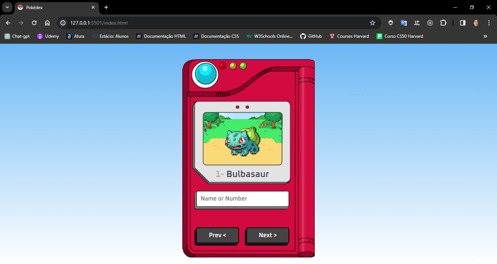
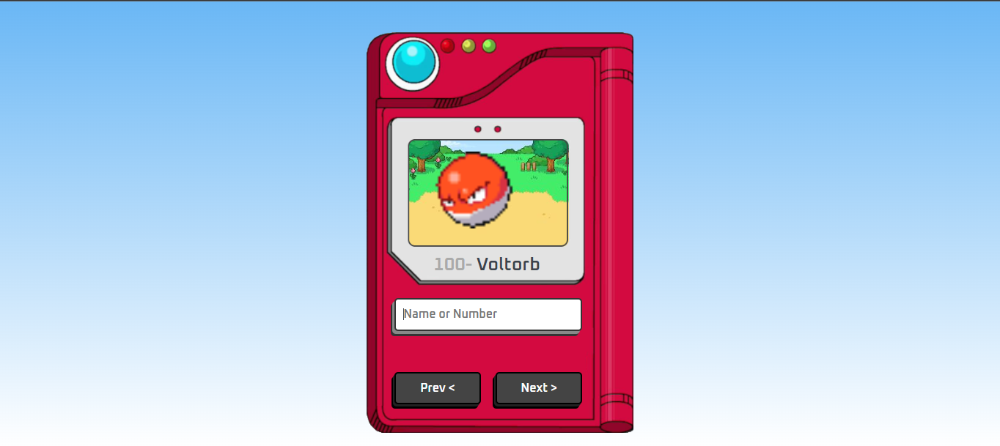

# Pokedex
[](https://github.com/GuilhermeHenrii/pokedex/blob/main/LICENSE)

# Sobre o projeto

Esse projeto foi desenvolvido com o intuito de desenvolver minhas habilidades com consumo de API. Consumi uma api chamada pokeapi e consumi dados como o nome do pokemon, imagens e seus IDs. Você pode buscar um pokemon digitando um id ou na seta de navegação.

## Layout mobile


## Layout web




# Tecnologias utilizadas
- HTML / CSS / JS / TypeScript

# Como executar o projeto

Pré-requisitos: VScode, Live Server

```bash
# clonar repositório
git clone https://github.com/GuilhermeHenrii/pokedex.git

# entrar na pasta do projeto front end web
cd pokedex

# executar o projeto
// Execute o Live Server

```

# Autor

Guilherme Henrique da Silva Lopes

https://www.linkedin.com/in/guilherme-henrique-7aab6b229/


 
